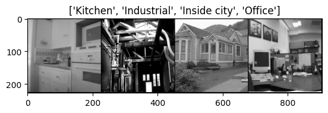
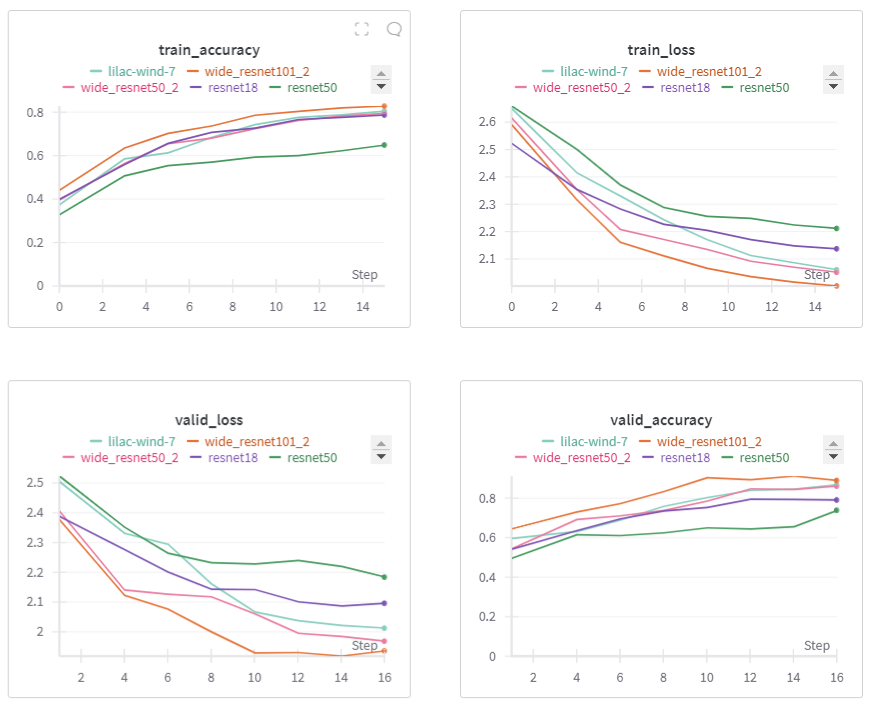

# LaimaTech x Canonist.AI

This is the report of LaimaTech x Canonist.AI Deep Learning model result for Idealista's image classification challenge.

## Comment

### Why Canonist.AI?

The proposal to implement this Deep Learning model on Idealista's platform will reduce the number of people hired to check all the uploaded images and avoid manual tagging. This will dramatically increase the speed at which new images are uploaded and reduce operating costs in the long run.

## Methodology

To choose the best Deep Learning possible, our team used Transfer Learning by leveraging already pre-trained models and finetuning them to make them perform well in our use-case scenario.

Given the ranking of the most widely trained and used models, we decided to train and test the following:
- ResNet18
- ResNet50
- Wide_resnet50_2
- Wide_resnet101_2
- Resnext50_32x4d

## Dataset

To train our model, we used the "15 class scene dataset", which contains 15 different types of scenarios:
- Bedroom
- Coast
- Forest
- Highway
- Industrial
- Inside City
- Kitchen
- Living room
- Mountain
- Office
- Open Country
- Store
- Street
- Suburb
- Tall building

This is particularly useful for our use case, as we will be dealing with all sorts of images related to buildings, both on the inside and the outside. Below is an example of the dataset.

## Trained Models

All models are Open Source and Licensed for commercial use 💡

We have trained 5 different models, all performing similarly. Due to the hardware and time restrictions, all models have been trained on 8 epochs, with 4 unfrozen layers, and default pre-trained model's weights.

The training results have been:

While not the best results, our best model scored 88% accuracy in the validation dataset (Unseen images during training).

We have also created an MVP to test the performance of our best model. To check it out, please head to [LaimaTech Streamlit App](https://laima-tech.streamlit.app/)
